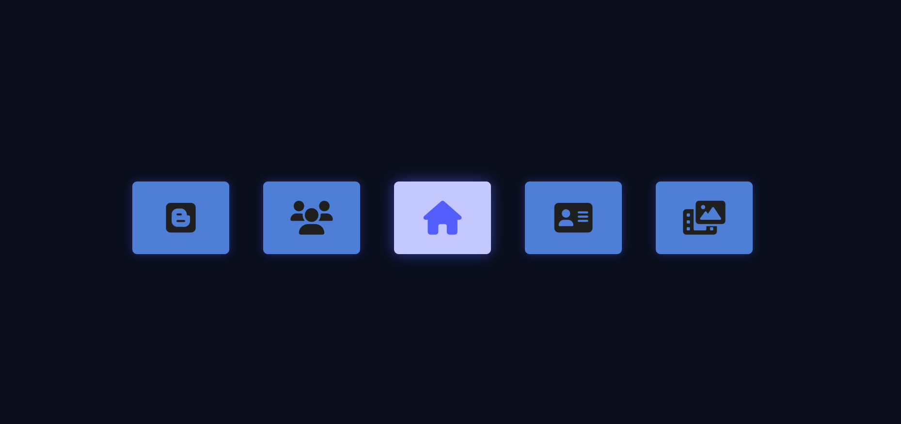

# 🎯 3D Hover Menu Animation

A creative and interactive **3D menu UI** built using HTML, CSS, and JavaScript. Hovering over the center icon reveals the full 3D animated menu layout with depth effects and icon transitions.

 <!-- Optional image: add a screenshot in your repo -->

---

## 🚀 Features

- 🧊 3D perspective animation using CSS `transform` and `perspective`
- 🌐 Font Awesome icons with hover transitions
- 🖱️ Menu expands on hover over the center icon
- 💻 Smooth transitions and modern layout

---

## 🛠 Technologies Used

- **HTML5**
- **CSS3** (`transform`, `transition`, `perspective`)
- **Vanilla JavaScript**
- **Font Awesome** (for the icons)

---

## 📦 How to Use

1. Clone the repo:
```bash
git clone https://github.com/xandra-X/3D-Menu
